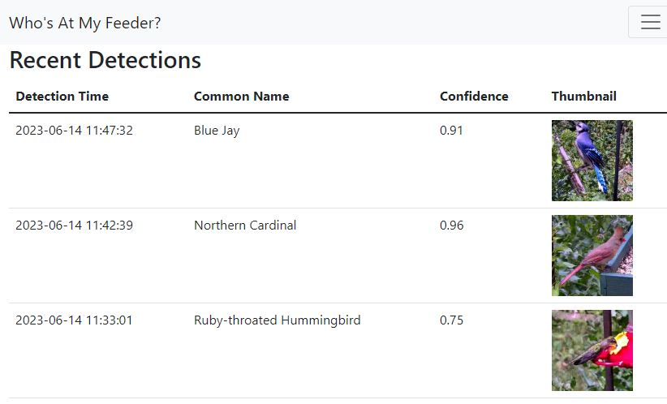

# Who's At My Feeder?

This app acts as sidecar to [Frigate](https://frigate.video/) to identify the species of
the birds that Frigate detects.

**Prequisites**

1. A working & Accessible Frigate Installation with at least 1 Camera
2. A MQTT Broker the Frigate successfully connects to
3. Configuration of the camera(s) in Frigate to DETECT and SNAPSHOT the 'bird' OBJECT

*Frigate Config*

As a prerequisite of running this project, you must set up Frigate to detect the ['bird' object](https://docs.frigate.video/configuration/objects) in a video stream, and
to send out [snapshots](https://docs.frigate.video/configuration/snapshots). This also assumes you have setup a MQTT broker, like [Mosquitto MQTT](https://github.com/eclipse/mosquitto)

*Docker Config*

Then, on the machine where you want to run this app, create a new directory. Copy
the [docker-compose.yml](https://github.com/mmcc-xx/WhosAtMyFeeder/blob/master/docker-compose.yml) file from here into that directory. Take a quick peek
at that file and make any changes that might be needed, like the timezone.

In your directory, make a directory called config, and copy [config/config.yml](https://github.com/mmcc-xx/WhosAtMyFeeder/blob/master/config/config.yml) from here
into your config directory. Edit it to make changes for your setup. You can add the names
of multiple cameras to the camera array. The model is already
in the image, so unless you want to use a different model, no need to change the
model name.

Finally, make a directory called data. The database will be created there.

Your directory structure should now look something like this before starting the container:
* /whosatmyfeeder
    * docker-compose.yml
    * /data/
    * /config/
        * config.yml

**Running the container**

Once you have completed the above, fire it up with `docker-compose up -d` If you used the default config file
and docker-compose file you should be able to access the web UI on http://127.0.0.1:7766
or on http://yourserveraddress:7766

The image is on Docker Hub at https://hub.docker.com/r/mmcc73/whosatmyfeeder
